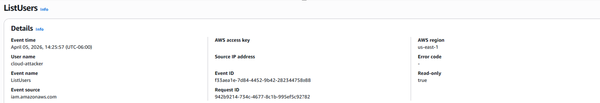

# 🔍 Cloud Reconnaissance

## 📊 Phase Highlights
☁️ AWS API Enumeration  
🔍 CloudTrail Log Analysis  
🧠 IAM & S3 Discovery  
📂 AccessDenied Pattern Analysis  
🧬 MITRE ATT&CK Mapping  
⚔️ API-Based Attacker Simulation  

---

## 📌 Overview
This phase simulates an attacker using valid IAM access keys from an external system (Kali Linux) to enumerate AWS resources via API calls.

The objective is to demonstrate how attackers perform cloud reconnaissance and how this activity is captured and analyzed using AWS CloudTrail.

---

## ⚔️ Attack Simulation

```bash
aws s3 ls
aws iam list-users
aws iam list-roles
aws sts get-caller-identity
```
## 📥 Log Collection

All API activity is recorded in AWS CloudTrail.

Each event contains:

- Event name (API call)
- User identity
- Source IP address
- Timestamp
- Error codes (if applicable)
## 🔍 Detection & Analysis
### Key Observations
- Successful S3 bucket enumeration
- IAM enumeration attempts
- Multiple AccessDenied responses
- API activity originating from external system
## 🚨 Detection Opportunities
- API activity from unusual IP addresses
- Enumeration behavior across AWS services
- Repeated AccessDenied events
- Use of access keys instead of console login
📸 Evidence
##🖥️ AWS CLI Activity (Kali)

Attacker performing API enumeration.

## ☁️ CloudTrail Event History

### API activity generated from attacker actions.
```bash
(kali㉿kali)-[~]
$ aws iam list-users

{
  "Users": [
    {
      "Path": "/",
      "UserName": "admin-user",
      "UserId": "AIDA********LAB",
      "Arn": "arn:aws:iam::123456789:user/admin-user",
      "CreateDate": "2026-04-05T19:49:49+00:00"
    },
    {
      "Path": "/",
      "UserName": "cloud-attacker",
      "UserId": "AIDA********LAB",
      "Arn": "arn:aws:iam::123456789:user/cloud-attacker",
      "CreateDate": "2026-04-05T19:59:18+00:00"
    }
  ]
}
```
<br>

<br>
## 📄 CloudTrail (Successful API Call)
<br>
```json
{
  "eventName": "ListUsers",
  "eventSource": "iam.amazonaws.com",
  "userName": "cloud-attacker",
  "sourceIPAddress": "External IP",
  "awsRegion": "us-east-1",
  "eventTime": "2026-04-05T20:25:57Z"
}
```

### 🔹 Analysis
The attacker used ListUsers to enumerate IAM identities within the AWS account.
This technique helps identify potential targets for privilege escalation or lateral movement, such as users with elevated permissions.


<br>

<br>

<br>
## 📄 CloudTrail JSON (Successful API Call)

## Example of successful enumeration.

Key Fields

"eventName": "ListBuckets",
"userIdentity": {...},
"sourceIPAddress": "X.X.X.X"

## ❌ CloudTrail JSON (AccessDenied)

Example of failed API attempt.

Key Indicator

"errorCode": "AccessDenied"
## 🧠 Key Insight

AccessDenied events reveal attacker intent and highlight permission boundaries within the environment.

## 🧬 MITRE ATT&CK Mapping
- Technique	Description
- Valid Accounts	Use of legitimate IAM credentials
- Account Discovery	Enumerating IAM users
- Cloud Service Discovery	Listing AWS resources
## 🛡️ Mitigation & Defense
- Enforce least privilege IAM policies
- Monitor API activity using CloudTrail
- Alert on repeated AccessDenied events
- Rotate and secure access keys
- Implement centralized logging and SIEM monitoring
## 📌 Summary

This phase demonstrates how attackers use valid credentials to perform cloud reconnaissance and how this behavior can be detected through API activity monitoring.

<p align="center">🔍 Foundation of cloud attack lifecycle</p> ```
