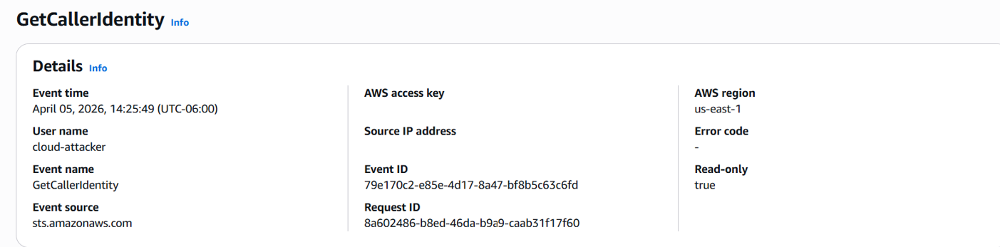
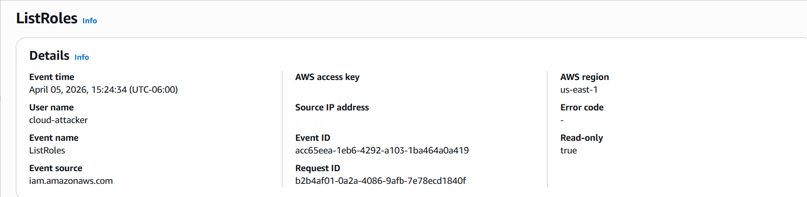
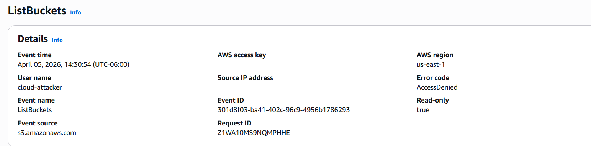

# 🔍 Cloud Reconnaissance

## 📊 Phase Highlights
☁️ AWS API Enumeration  
🔍 CloudTrail Log Analysis  
🧠 IAM & S3 Discovery  
📂 AccessDenied Pattern Analysis  
🧬 MITRE ATT&CK Mapping  
⚔️ API-Based Attacker Simulation  

---

## 📌 Overview

The objective is to demonstrate how attackers perform cloud reconnaissance and how this activity is captured and analyzed using AWS CloudTrail.

---

## ⚔️ Attack Simulation

```bash
aws s3 ls
aws iam list-users
aws iam list-roles
aws sts get-caller-identity
```
## 📥 Log Collection

All API activity is recorded in AWS CloudTrail.

Each event contains:

- Event name (API call)
- User identity
- Source IP address
- Timestamp
- Error codes (if applicable)
## 🔍 Detection & Analysis
### Key Observations
- Unsuccessful S3 bucket enumeration
- IAM enumeration
- AccessDenied responses
- API activity originating from external system

##🖥️ AWS CLI Activity (Kali)

Attacker performing API enumeration.
## ⏱️ Attack Timeline

| Step | Action | Purpose |
|------|--------|--------|
| 1 | `GetCallerIdentity` | Validate credentials and confirm account access |
| 2 | `ListUsers` | Enumerate IAM identities |
| 3 | `ListRoles` | Identify privilege escalation opportunities |
| 4 | `ListBuckets` | Attempt resource enumeration (AccessDenied) |

## ☁️ CloudTrail Event History
### Identity Verification
```bash
(kali㉿kali)-[~]
$ aws sts get-caller-identity
{
  "UserId": "AIDA********LAB",
  "Account": "123456789",
  "Arn": "arn:aws:iam::123456789:user/cloud-attacker"
}
```
## 📄 CloudTrail (Successful API Call)

```json
{
  "eventName": "GetCallerIdentity",
  "eventSource": "sts.amazonaws.com",
  "userName": "cloud-attacker",
  "sourceIPAddress": "External IP",
  "awsRegion": "us-east-1",
  "eventTime": "2026-04-05T20:25:49Z"
}
```
### 🔹 Analysis
The attacker used GetCallerIdentity to confirm that the credentials were valid and to determine the AWS account context. This step is commonly performed immediately after gaining access to verify authentication and understand the scope of access.

### IAM List Users
```bash
(kali㉿kali)-[~]
$ aws iam list-users

{
  "Users": [
    {
      "Path": "/",
      "UserName": "admin-user",
      "UserId": "AIDA********LAB",
      "Arn": "arn:aws:iam::123456789:user/admin-user",
      "CreateDate": "2026-04-05T19:49:49+00:00"
    },
    {
      "Path": "/",
      "UserName": "cloud-attacker",
      "UserId": "AIDA********LAB",
      "Arn": "arn:aws:iam::123456789:user/cloud-attacker",
      "CreateDate": "2026-04-05T19:59:18+00:00"
    }
  ]
}
```
## 📄 CloudTrail (Successful API Call)


```json
{
  "eventName": "ListUsers",
  "eventSource": "iam.amazonaws.com",
  "userName": "cloud-attacker",
  "sourceIPAddress": "External IP",
  "awsRegion": "us-east-1",
  "eventTime": "2026-04-05T20:25:57Z"
}
```

### 🔹 Analysis
The attacker used ListUsers to enumerate IAM identities within the AWS account.
This technique helps identify potential targets for privilege escalation or lateral movement, such as users with elevated permissions.

### IAM List Roles
```bash
(kali㉿kali)-[~]
$ aws iam list-roles

{
  "Roles": [
    {
      "Path": "/aws-service-role/resource-explorer-2.amazonaws.com/",
      "RoleName": "AWSServiceRoleForResourceExplorer",
      "RoleId": "AROA********LAB",
      "Arn": "arn:aws:iam::123456789:role/aws-service-role/resource-explorer-2.amazonaws.com/AWSServiceRoleForResourceExplorer",
    }
```
## 📄 CloudTrail (Successful API Call)

```json
{
  "eventName": "ListRoles",
  "eventSource": "iam.amazonaws.com",
  "userName": "cloud-attacker",
  "sourceIPAddress": "External IP",
  "awsRegion": "us-east-1",
  "eventTime": "2026-04-05T21:24:34Z"
}
```
### 🔹 Analysis
The attacker performed ListRoles to identify IAM roles and their trust relationships. Enumerating roles helps uncover potential privilege escalation paths, especially if roles can be assumed (sts:AssumeRole) or are overly permissive.
### S3 Bucket Enumeration
```bash
(kali㉿kali)-[~]
$ aws s3 ls

An error occurred (AccessDenied) when calling the ListBuckets operation: User:
arn:aws:iam::123456789:user/cloud-attacker is not authorized to perform:
s3:ListAllMyBuckets because no identity-based policy allows the
s3:ListAllMyBuckets action
```
❌ CloudTrail (AccessDenied)

```json
{
  "eventName": "ListBuckets",
  "eventSource": "s3.amazonaws.com",
  "userName": "cloud-attacker",
  "sourceIPAddress": "External IP",
  "awsRegion": "us-east-1",
  "eventTime": "2026-04-05T20:30:54Z",
  "errorCode": "AccessDenied",
  "errorMessage": "User: arn:aws:iam::123456789:user/cloud-attacker is not authorized to perform: s3:ListAllMyBuckets because no identity-based policy allows the s3:ListAllMyBuckets action",
}
```
### 🔹 Analysis
The attacker attempted to list S3 buckets to discover accessible storage resources that may contain sensitive data. The request failed due to insufficient permissions, indicating proper access controls were in place for this action.

## 🧬 MITRE ATT&CK Mapping
| Technique | ID | Example |
|----------|----|--------|
| Account Discovery | T1087.004 | `ListUsers`, `GetCallerIdentity` |
| Permission Groups Discovery | T1069.003 | `ListRoles` |
| Cloud Service Discovery | T1526 | `aws s3 ls` |
## 🛡️ Security Framework Mapping
### 🔹 NIST SP 800-53
| Control | Relevance |
|--------|----------|
| AC-6 (Least Privilege) | AccessDenied confirms restricted permissions |
| AU-6 (Audit Review) | CloudTrail enables detection of API activity |
### 🔹 CIS AWS Foundations Benchmark
| Control | Observation |
|--------|-------------|
| 1.5 (MFA) | Not enforced → potential risk |
| 3.x (Logging) | CloudTrail enabled for API monitoring |
## 🛡️ Mitigation & Defense
- Enforce least privilege IAM policies
- Monitor API activity using CloudTrail
- Alert on repeated AccessDenied events
- Rotate and secure access keys
- Implement centralized logging and SIEM monitoring
## 📌 Summary

This phase demonstrates how attackers use valid credentials to perform cloud reconnaissance and how this behavior can be detected through API activity monitoring.

<p align="center">🔍 Foundation of cloud attack lifecycle</p> ```
